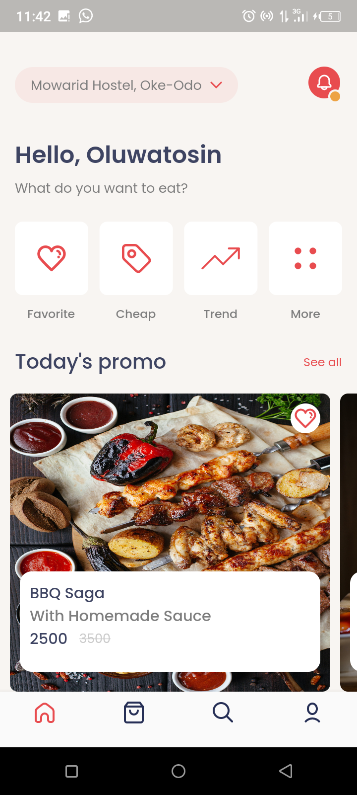
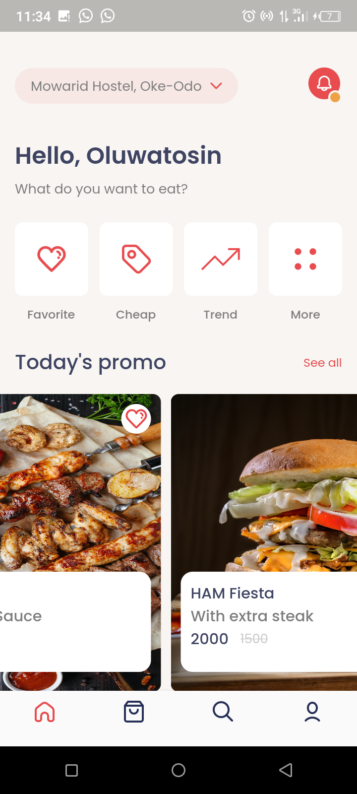
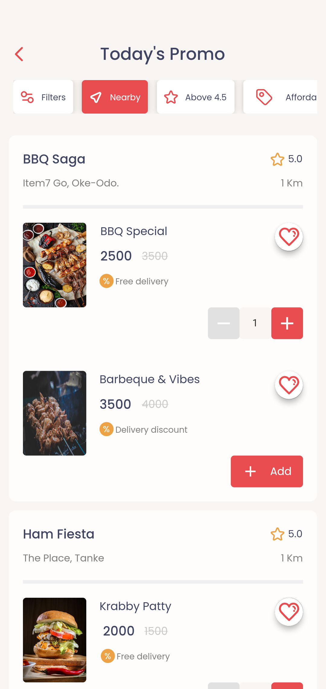
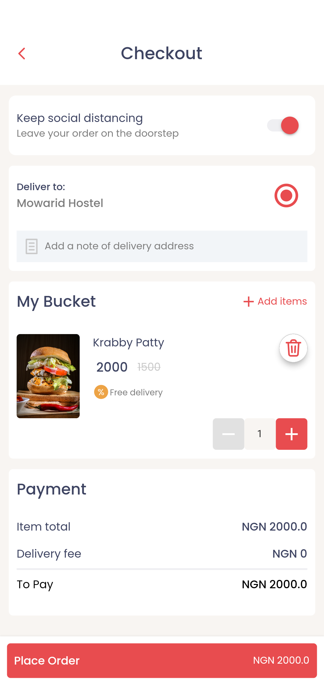

# FOODIE ✨🥂

This is an app UI that can allow users to order food from the comfort of their homes.

Developed using the knowledge of Flutter and Dart, for the love of FOOD😋😁
 


## Authors 👧🏾

- ADEPITAN OLUWATOSIN SIMILOLUWA [@fiki2002](https://www.github.com/fiki2002)


## Features 😎

- 5 responsive screens
- Basically UI
- Increase number of orders 
- Pass data through screens
- Cross platform


## Screenshots📷

    
    
    
 


## ✨ Requirements 

- Any Operating System (ie. MacOS X, Linux, Windows)
- Any IDE with SDK installed (ie. IntelliJ, Android Studio, VSCode etc)
- A little knowledge of Flutter and dart

## You can take a look 😀

Clone the project

```bash
  git clone https://github.com/fiki2002/FOODIE.git
```

Go to the project directory

```bash
  cd FOODIE
```

Open code on VScode

```bash
  code .
```

Install dependencies

```bash
  flutter pub get
```

Run the app

```bash
  flutter run
```

